```{r setup, include=FALSE}
knitr::opts_chunk$set(echo = FALSE)
```

# 1. Critiques and Suggestions on Current Visualisation

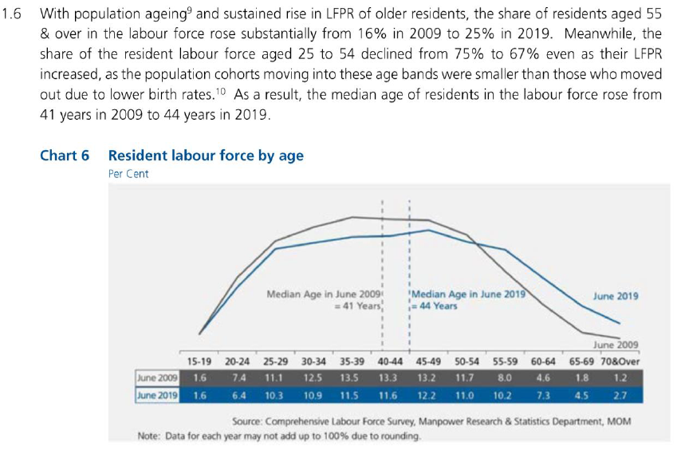
**Clarity**

|  Critiques | Suggestions|
|:---------:|:----------:|
| 1) Information in the lead-in paragraph could not be visualized/interpreted from the chart. For example, it stated the share of labour force aged 25 to 54 declined from 75% to 67%. That could not be interpreted from the chart, as the population are grouped in 5-year brackets. | The dashboard title and lead-in to be able to relate and provide an intuitive understanding to the chart visualisation.                                                     |
| 2) The visualisation only depicts the comparison statistics from 2009 and 2019. It lacks the information on the changes between 2009 and 2019.| The chart visualisation will incorporate the data from 2009 to 2019 to gain more insights to the change in resident labour population over the years. |
| 3) It is not clear whether x-axis labels i.e. 15-19,is categorical or continuous. There is no x-axis title to explain the axis value. Lack of a y-axis and gridlines to provide a gauge for the values. | To ensure accurate x and y-axis labels with axis title to describe the axis.|
| 4) The median age reference lines used might not be accurately reflecting the chart as the x-axis of “40-44” might be a categorical data.| To use other statistical values to provide insights to the labour force participation. |

**Aesthetics**

| Critiques | Suggestions  |
|:--------:|:-------------:|
| 1)  The x-axis labels are not aligned to the tick marks but in between the tick marks. | Incorporate proper axis labelling and aligning. |
| 2) Poor colour coding. The colour of the “June 2009” line is too close to the background colour. | Proper colour but non-excessive colour coding to highlight necessary information.|
| 3) Poor spacing between the chart axis and the table. | Instead of using a table, proper axis will be in place to show the values in the visualisation |

# 2. Proposed Visualisation Design

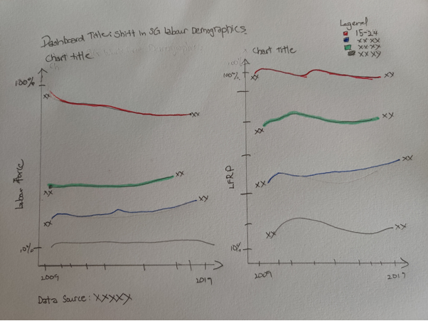
Using the above alternative visualisation, it retains the intent of the lead in paragraph which is to be able to compare the labour force participation rate directly with actual resident population in the workforce through a dual axis visualisation.

It also follows the re-grouping of the age groups into in the lead-in paragraph by classifying into 3 groups “Age 15-24”, “Age 25-54” and “Age 55 & over”. 

# 3. Tableau Visualisation Steps

Data Preparation in Excel

| S/N |          Area          |                                                                Action                                                               |
|:---:|:----------------------:|:-----------------------------------------------------------------------------------------------------------------------------------:|
|  1  | Remove irrelevant data | Removed one row of data under   “Total” from excel data file “mrsd_2019LabourForce_T7”.                                             |
|  2  | Extract relevant data  | Extracted fives rows of data   under “15 -24”, “25 -54”, “55 -65” and “65 & over” from excel data file   “mrsd_2019LabourForce_T5”. |


Chart Preparation in Tableau

| S/N | Area | Action     |
|-----|------|------------|
| 1   | Import data (Excel) into Tableau     | -  Connection was created with “mrsd_2019LabourForce_T7”.<br>  -  Using sheets “T7_T” from the data, a column containing “null” values was hidden.<br> -  The columns for the individual years, were highlighted and pivoted to transpose the data. <br/> 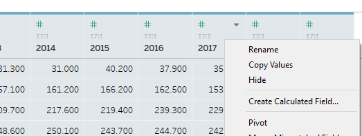{Width=100%} <br> -  The new column was renamed and data type changed from “String” to “Year”. <br> 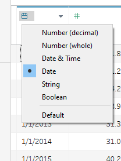{Width=100%} <br> -  “Age (Years)” renamed to “Age Group (Years)” <br> -  Another data source “mrsd_2019LabourForce_T5” was added. <br> 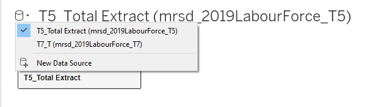{Width=100%} <br> -  Same steps were taken to transpose the “Year” columns and to change data type.|
| 2   | Grouping the Age Groups| -            In Sheet 1, the “Age Group (Years)” table is further grouped through the “Create”, “Group” function as shown.<br/> 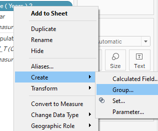{Width=100%}<br> -  The “Age Group” was further grouped into 4 main groups namely “15 -24”, “25 -54”, “55 -65” and “65 & over”. <br/> 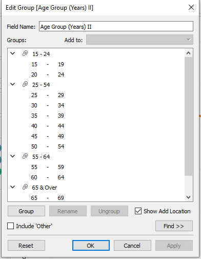{Width=100%}<br> - Creating a new Table “Age Group (Years) II”. |
| 3   | Creating first chart| -            The first chart shows the resident labour force in each of the age group.<br/> - The “Year” measure was dragged to column and the “Population”   measure was dragged to Rows. The mark was change to “Line”.<br/> - To view the labour participation rate, “Quick Table   Calculation” was used to calculate “Percent of Total” and computed using “Table (down)”.<br/> 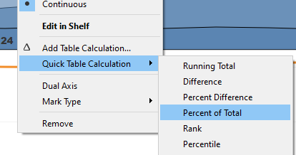{Width=100%} 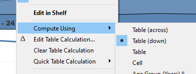{Width=100%}<br>- “Sum(Population)” was Ctrl+ Drag to Label. “Line Ends” option was selected.<br/> 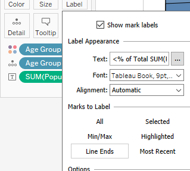{Width=100%}<br>-  The y-axis was renamed to “Labour Force by Age Group” <br/> - “Sheet 1” was renamed as “Workforce”.|
| 4   | Creating second chart| -            The first chart shows the resident labour force participation rate in each of the age group.<br/> -          A new calculation field “LFPR%” was created with the formula "[LFPR]/100”. This is in order to display the data in percentage format.<br/>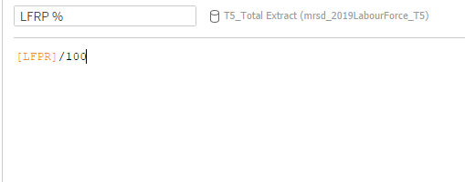{Width=100%}<br> -          The “Year” measure was dragged to column and the “LFPR%”   measure was dragged to Rows.<br/> -          “LFPR%” was dragged to Label. “Line Ends” option was selected.<br/> -          The y-axis was renamed to “Labour Force Participation Rate”. Y-axis formatted to show percentage.<br/> 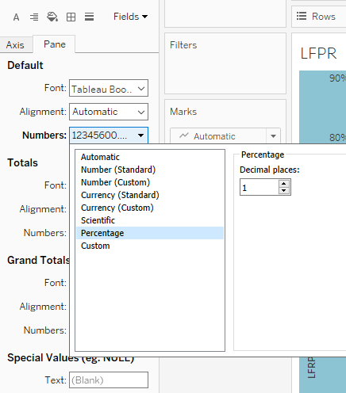{Width=100%}<br> -          “Sheet 2” was renamed as “LFPR”. |
| 5   | Creating of dashboard And formatting | -            Drag “Workforce” and “LFPR” sheet into dashboard.<br/> -            Drag Text bar to create dashboard title and data source.<br/> -            Axis of both charts were edited for them to align.<br>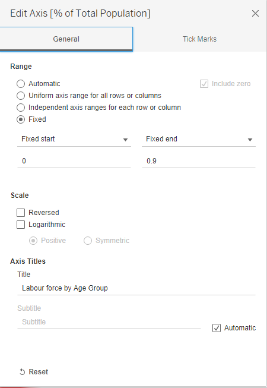{Width=100%} |


# 4. Final Visualisation

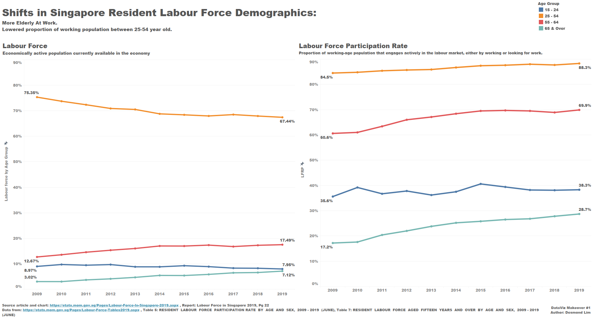

# 5. Insights

1. The labour force participation rate for the elderly (55 years old and above) has increased significantly over the years. From 2009 to 2019, the LFPR for the 55 to 64 age group increased from 60.65 to 69.9% and 17.2% to 28.7% for the 64 and above age group. Correspondent changes were seen in the elderly proportion in the labour force with an increase in about 5% for the 55 to 64 age group and about 4% in the 65 and above age group.

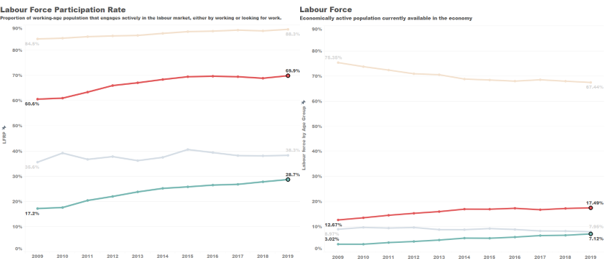

2. Although the labour force participation rate for the main workforce (25-54 years) has increased to 88.3% in 2019 from 84.5% in 2009. A significant drop was seen in the age group’s proportion in the labour force from 75.35% to 67.44%. This was due to the aging of the main force and transitioning into the elderly work force (55 and over) over the past 10 years. 

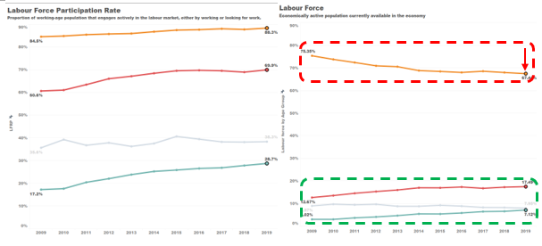
3. The proportion of the youth (15-24 years) in the labour force is stable with a drop of about 1% from 8.97% (Year 2009) to 7.95% (Year 2019). However, there is an increase of labour force participation rate from 35.6% to 38.3%. 
