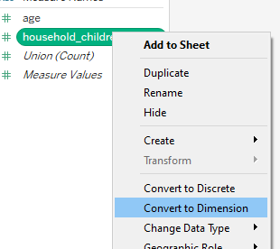
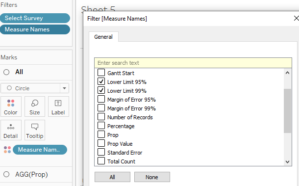
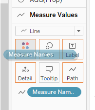
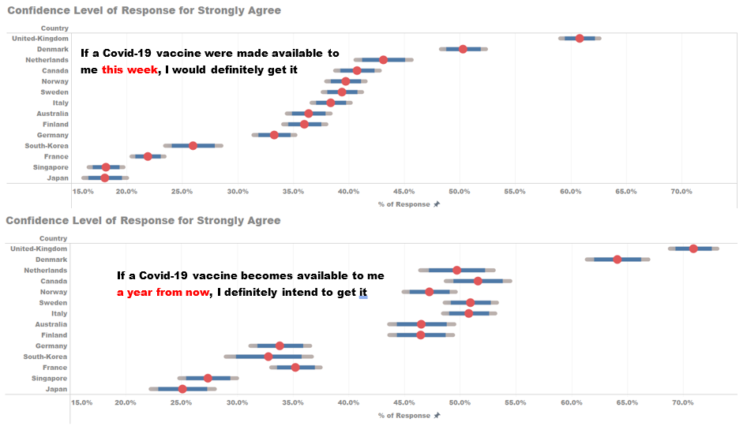

```{r setup, include=FALSE}
knitr::opts_chunk$set(echo = FALSE)
```
# 1.	Original Visualisation


# 2.	Critiques and Suggestions on Original Visualization

**2.1 Clarity**

|     Critique   |     Suggestions  |
|----------------|------------------|
|     The country names on the y-axis are sorted differently on both charts. One is sorted alphabetically, while another is sorted on a descending order. It will be   difficult for the reader to compare one country on the two charts. | To sort both charts similarly, either by value or alphabetically.  |
|     It is difficult to visualise the overall sentiment of the respondents through the first 100% stacked bar chart. We are only able to compare the extreme   responses.  | To use a divergent stacked bar chart to be able to visualise the positive and negative responses.                            |
|     The accuracy of the percentage response is uncertain as there is no information on the sample size it is conducted on in each country. | Make use of   confidence interval chart to reflect the margin of error for the responses being given for each score. |
|     The second chart can only show the response level to those who strongly agree to vaccination but unable show other responses   |     To enabling interactivity in the visualisation, i.e. the selecting of different responses   will be reflected in the chart.    |
|     The charts does not show what was the question being asked to the public.  |     To show what was the question asked to the respondents. |

**2.2 Aesthetics**

|     Critique  |     Suggestions |
|---------------|-----------------|
|     Since the axis title for both charts i.e. “% of Total Record” and “% Strongly agreed” is redundant as what the chart is trying to show has been clearly stated on   the chart titles.     |     To ensure the chart title and axis title is meaningful and does not repeat.   |
|     The decimal place for the percentage value on the x-axis for the two charts are different. One is whole figure and another is showing to one decimal place. |     To ensure decimal places shown chart values and axis values are standardized. |
|     The name of the countries on y-axis are not capitalized i.e. first letter not in uppercase.  |     To edit the country name .  |
|     For the legend, only 1 and 5 is explained with “Strongly Agree” and “Strongly Disagree”. The rest are only in numbers.   |     The scale should be changed to explained the score representation. i.e. Strongly Agree, Agree, Neutral, Disagree, Strongly Disagree.    |


# 3.	Proposed Visualisation

**3.1 Sketch**


**3.2 Advantages of new visualisation**

Using the above alternative visualisation, it retains the intent of the original charts to reflect a country’s response to the Covid-19 vaccination but made it more intuitive by highlighting the positive responses and negative responses. The survey question being asked is made available to show what was really asked to the public.  The tooltip also allow the reader to have within row (country) comparison of the survey response. 

The second chart is able to go in further detail the proportion of each score response and highlight the margin of error for each response. 

Interactivity is also introduced to allow the reader to filter amongst the different variables present in the data set and look at survey responses from other survey questions. 


# 4.	Data Visualisation Steps

**4.1	Data Source**

The data used was obtained from the Imperial College London YouGov Covid 19 Behaviour Tracker Data Hub. The datafiles contain responses from surveys of the general public from about symptoms, testing, self-isolation, social distancing and behaviour from 21 countries. 

For the purpose of the DataViz makeover, the data from the following surveys were used: 

|     Survey Code    |     Question                                                                                                   |
|--------------------|----------------------------------------------------------------------------------------------------------------|
|     vac_1          |     If a Covid-19 vaccine were made available to me this week, I would definitely get it                       |
|     vac2_1         |     I am worried about getting COVID19                                                                         |
|     vac2_2         |     I am worried about potential side effects of a COVID19 vaccine                                             |
|     vac2_3         |     I believe government health authorities in my country will provide me with an effective COVID19 vaccine    |
|     vac2_6         |     If I do not get a COVID19 vaccine when it is available, I will regret it                                   |
|     vac_3          |     If a Covid-19 vaccine becomes available to me a year from now, I definitely intend to get it               |


As only 14 countries were found with the above surveys, only data from these 14 countries were used. The 14 countries are: 

|     Countries    |                |                    |                    |                        |
|:----------------:|----------------|--------------------|--------------------|------------------------|
|     Australia    |     Finland    |     Italy          |     Norway         |     Sweden             |
|     Canada       |     France     |     Japan          |     Singapore      |     United- Kingdom    |
|     Denmark      |     Germany    |     Netherlands    |     South Korea    |                        |

**4.2	Data Preparation in Excel**


1)	The “employment_status” variable was found to be classified differently in data from Denmark, Finland, Norway and Sweden.  The employment status variable was split into 7 columns based on the original values as shown in below. 


2)	To obtain the “employment_status” variable, the column headers were changed to the 7 values as shown below


3)	The following excel equation “=INDEX($CU$1:$DA$1,MATCH("Yes",CU2:DA2,0))” was used to obtain the employment status. The same method was applied to the Denmark, Finland, Norway and Sweden data set. 

4)	The scores for the different surveys were classified into “1 - Strongly Agree”, “2”, “3”, “4” and “5 -Strongly Disagree”. The string value of “Strongly Agree” and “Strongly Disagree” would affect data in Tableau later on, the values of “1 - Strongly Agree” and “5 -Strongly Disagree”, were replaced with “1” and “5” respectively for all the country data sets used.

**4.3	Data Preparation in Tableau**

1)	To prepare the data in Tableau, one of the country’s data set is first dragged into Tableau. 


2)	The data is then removed as shown. The “New Union” tab is dragged to the interface, generating a “Union” window. The dataset of all the countries are selected and dragged into the “Union” window as shown below. 


3)	The unrelated fields are selected and hidden, leaving behind the following fields.<br>


4)	The “Table Name” file is split to form a new column and the new field is renamed as “Country”.<br> 
  


5)	In “Sheet 1”, the data type for the following is changed from “String” to “Number (Whole)”. 
{Width=40%}

6)	Convert the measure “household_children” to dimension and group the number of children above 5 to “5 and more”. Renamed to “No. of Children”.



**4.4 Diverging Stacked Bar Chart**

**Creating Calculated Field**

1)	A new calculated field is created from the “Analysis” tab, with the “Create Calculated Field “option.<br>


2)	A calculated field called “Number of Records” is created as shown. 


3)	Another calculated field “Total Count” is created similarly with the below formula.


4)	A new parameter “Survey” is created with settings shown below. The names of the survey were changed to the question of the survey. The parameter is set to “Show Parameter”.


5)	A calculated field named “Select Survey” is created. This field is to allow the switch of surveys between vac_1, vac2_1, vac2_2, vac2_3, vac2_6 and vac_3. The “Show Parameter” option was selected.<br> 


6)	The survey score was edited to show to reflect 1 as “Strongly Agree”, 2 as “Agree”, 3 as “Neutral”, 4 as “Disagree” and 5 as “Strongly Disagree” by choosing to edit “Alias” on “Select Survey”.<br>


7)	As the value “1” refer to strongly agree, the score is sort in a descending order. 


8)	A calculated field “Count Negative” is created as shown below to count the number of negative responses and half the neutral responses. 


9)	A calculated field “Total Count Negative” is created. 


10)	A calculated field “Percentage” is created.<br>


11)	To work out where the first position of the Gantt bar, a calculated field “Gantt Start” is created by dividing the negative of “Total Count Negative” by “Total Count”.


12)	A calculated field “Gantt Percent” is created to find the gantt position of the different responses by taking the previous response position and adding in the current response percentage.<br>


**Creating Visualization**

1)	To create the chart, the “Country” measure is dragged to the Rows and “Gantt Percent” is dragged to Columns.<br> 


2)	The “Select Survey” measure is dragged to filter. All values are selected other than the ”Null” values.<br> 


3)	“Select Survey” is dragged to the Detail card and “Gantt Percent” changed to calculate using “Select Survey”.


4)	The Mark Type for the chart is changed to “Gantt Bar”, “Select Survey” is dragged to the Colour card and “Percentage” to the Size card.<br> 


5)	Edit the colours of the survey score.<br> 

6)	Format the x-axis to show percentage values. Edit the axis for uniform axis range and title.<br> 
 

7)	In a new sheet i.e. Respondents, drag “Country” to Rows and drag “Number of Records” onto “Text” card and edit text as shown. 


8)	To create a histogram chart as a tooltip. In another new sheet i.e. Histogram, by dragging “Country” and “Select Survey” to Columns and “Percentage” to Rows. 


9)	Right click on “Percentage” and select compute using “Select Survey”. 


10)	“Percentage” is dragged to the Label card and aligned as shown.


11)	Create tooltip at the main sheet by clicking on "Tooltip" under the "Marks" card and linking “Respondents” and “Histogram” sheets and include percentage values.


12)	A reference line was added at zero to differentiate the positive and negative segments.


13)	Chart title “Question: <Parameters.Survey>” added. 

14)	Standardize font to Arial Black and font color of axis.

15) The completed visualisation for the diverging stacked bar chart will looked as below.


**4.5 Confidence Interval Chart**

1)	Next, in order to visualise the uncertainty in the survey results i.e. margin of error. A confidence interval chart is use. 

2)	First, a parameter “Survey Score” was created to allow which survey response score to be compared.<br> 


**Creating Calculate Fields**

1)	Create a calculated field, “Select Score”.<br>
{Width=30%}

2)	Another calculate field, “Prop Value” is created. This helps to determine the number of respondents choosing a certain score.<br>
{Width=30%}

3)	Next calculated field to be created is “Prop”, to determine the percentage of respondents choosing a certain score.<br>
{Width=30%}

4)	A “Standard Error” calculated field is created to obtained the standard error in confidence intervals.<br>


5)	Two calculated fields are created “Z Value 95%” and “Z Value 99%”. These are multiplier used to calculate the survey results are within 95%/99% of the possible responses. 


6)	Two more fields “Margin of Error 95%” and “Margin of Error 99%” are created. 


7)	Two calculated fields “Lower Limit 95%” and “Lower Limit 99%” for the lower limit for the 95% (99%) error bar. 


8)	Similarly, two calculated fields “Upper Limit 95%” and “Upper Limit 99%” to reflect the upper limit for the 95% (99%) error bar is created. 


**Creating Visualization**

1)	To create the visualisation, the “Country” measure is dragged to the Rows and “Prop” is dragged to Columns.<br> 


2)	Similar to the previous chart, the “Select Survey” measure is dragged to filter. All values are selected other than the ”Null” values.<br> 

3)	The Mark Type for the chart is changed to “Circle”.<br>


4)	Drag “Measure Values” to Columns, and right click on the Measure Values to create dual axis. Right click on the lower x-axis and choose “Synchronize Axis”.<br>
 
 

5)	Filter the “Measure Names” by right-clicking it on the Filters card and retain “Lower Limit 95%”, “Lower Limit 99%”, “Upper Limit 95%” and “Upper Limit 99%”.


6)	Under “Measure Value” in the Mark card, change the Mark type to “Lines” and drag “Measure Names” to “Path”.<br> 


7)	Drag “Measure Names” to “Color”, click on “Color” and edit the color palette to match the confidence intervals.<br> 
 

8)	Hide the top header by unchecking “Show Header”.<br>
 

9)	Format the x-axis to show percentage values. Edit the axis for uniform axis range and title.<br> 
 

10)	The chart tile “Confidence Level of Response for <Parameters.Survey Score>” is added to include show the survey score parameter. 

11)	Standardize font to Arial Black and font color of axis.

12) The completed visualisation for the confidence interval chart will looked as below.<br> 


**4.6 Filters**

1)	The “Gender” dimensions is dragged to the Filter card and set to “Show Filter”.
 

2)	The same were done to “Employment Status”, “Household Size” and “No. of Children”.  


3)	All the filters were set to apply to all worksheets using the same data source and a single value dropdown. 

4)	The “Age” measure was dragged to filter and set to filter by range. 


**4.7 Dashboard**

1)	Title of dashboard is added. Title: “How about a Vaccine for you? Survey on Covid-19 Vaccine.”

2)	Commentary is added by dragging “Text” from “Objects” to the bottom of the title. Commentary states “Responses from the general public in 14 countries, given towards questions asked regarding the Covid-19 vaccine.”

3)	The “Diverging stacked Bar” sheet and “CI Chart” sheet under “Sheets” is dragged to the dashboard space. All filters with survey score legend are retained. 

4)	“Text” is dragged to the bottom left of the dashboard to include source information: 
“Source from: https://github.com/YouGov-Data/covid-19-tracker
Data from:https://github.com/YouGov-Data/covid-19-tracker/tree/master/data”

5)	Another textbox  is created at the bottom right of the dashboard to add the following text:
“DataViz Makeover #2   Author: Desmond Lim”


# 5.	Final Visualisation


# 6. Main Observations

1)	 Most countries show general positive sentiment towards taking the Covid-19 vaccine if made available, as shown in the chart. i.e. Positive sentiments higher than negative sentiments. Only France out of the 14 countries shows a negative sentiment response to the vaccine. 


2)	For VAC_1, there is a larger margin of error responses for Netherlands, Japan and South Korea compared to the other countries. This is due to the smaller sample size of respondents from the three countries. Netherlands with 10,899, Japan with 10,887 respondents and South Korea with 9,807 respondents. The next lowest country is Canada with 18,780 respondents, which is almost two times South Korea’s. 


3)	Comparing VAC_1 with VAC_3, where VAC_3 is about willing to take the vaccine when made available 1 year later, there is a significant increase from the public response from various countries where the public strongly agrees with the statement, i.e. France from 21.9% to 35.3%, Singapore from 18.1% to 27.4%.  This shows a portion of the public still doubts the efficacy of the Covid-19 vaccine at this stage.


