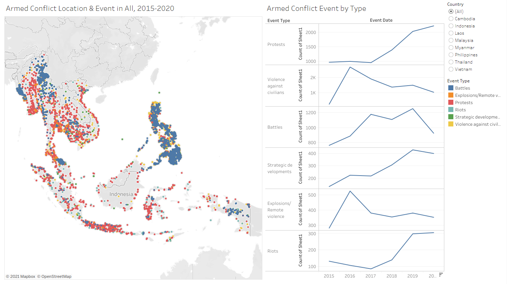
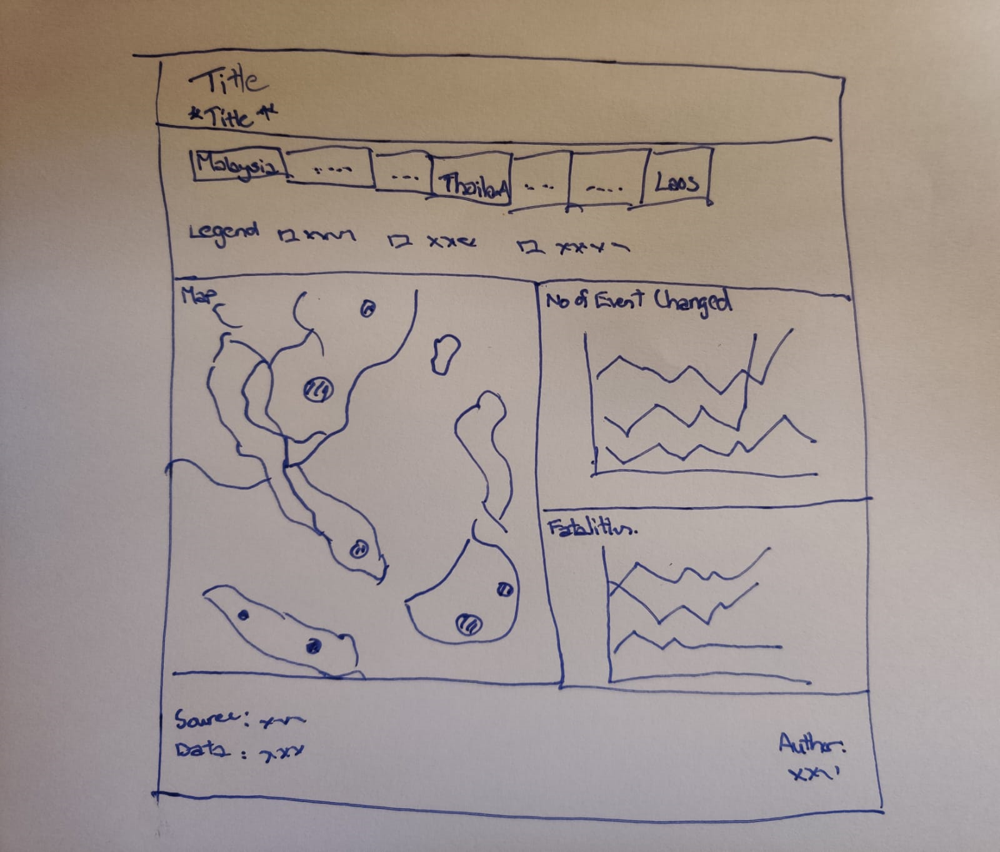
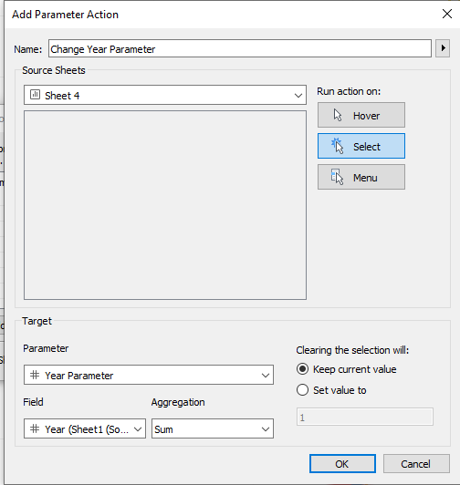

```{r setup, include=FALSE}
knitr::opts_chunk$set(echo = FALSE)
```

# 1.	Original Visualisation



# 2.	Critiques and Suggestions on Original Visualization

**2.1 Clarity**

|     Critique  | Suggestions |
|---------------|-------------|
|     The visualization is unable to provide further clarity/breakdown on the type of sub-events that occur. |  To include variable information in charts and tooltips.|
|     The event location dots overlap each other when all the events are chosen. i.e. the Battles (blue) event will cover any others below. Thus unable to visualise the actual events happening in the area.  |     To consolidate events into state level events for better visualization and less cluster on map.    |
|     Unable to know which state/area the event has happened in. Only the latitude and longitude are shown in tool tip.  |  To include necessary variable information in charts and tooltips.|


**2.2 Aesthetics**

|     Critique   |     Suggestions  |
|----------------|------------------|
|     The y-axis of the line chart which stated “Count of Sheet1” is not properly titled. |     To provide  appropriate title to the axis to explain the chart.  |
|     The color scheme used for the difference event type is not optimal. i.e. Riots and  strategic developments color shade is very close.     |     To ensure color theme used is visible and able to be easily differentiated.   |
|     The event location dots are cluttered covering the country names. No way of seeing  which dots are on which country other than via the country filter.   |     To consolidate   events into state level events for better visualisation and less clustered on map.    |


**2.3 Interactivity**

|     Critique   |     Suggestions    |
|----------------|--------------------|
|     Country filtering is done through a typical map filter function on the dashboard.  |     To use dashboard actions to allow interactive filtering of countries. |
|     There is no way of comparing event changes for a certain reference year through the event type chart.  |     To create reference year choosing function directly on the chart to allow comparison between multiple reference years.    |


# 3.	Proposed Visualisation

**3.1 Sketch**
	

	
**3.2 Advantages of New Visualisation**

The new visualisation will be able to provide a better general overview of the conflict event situation in South East Asia through the choropleth map. Detailed information on events that occurred in each state will also be shown. By clicking on the country name on the dashboard, the specific country will be chosen and charts will change according to the chosen country, allowing more insights to be obtained. The two charts will be able to provide information not available in the original visualisation.

Interactivity wise, the percentage change of events over the time period can be shown with a reference year which can be chosen by clicking any data point for that year in the chart. Changing the reference year will at the same time change the year parameter of the map, switching it to the reference year. The top 5 sub events that occurred in each country can also be shown in the charts provide details on the fatalities that occurred in those events. 


# 4.	Data Visualisation Steps

**4.1	Data Source**

The data used was obtained from the Armed Conflict Location & Event Data Project (ACLED). The datafiles contain dates, actors, locations, fatalities, and types of all reported political violence and protest events across Southeast Asia.

**4.2	Data Preparation in Tableau**

1)	The data set “Southeast-Asia_2010-2020_Oct31” was dragged into Tableau and fields were checked for discrepancy. 

2)	The unrelated fields are selected and hidden.


3)	The variable “Admin1” was renamed as “State” and changed its geographic role to “State/Province” as shown. 


**4.3	Geographic Map**

1)	A calculated field called “Number of Events” is created as shown. 


2)	The “Longitude” measure was dragged to column and “Latitude” measure to rows


3)	The “Country” measure was dragged to Detail card and “Number of Events” was dragged to the Color card. <br>


4)	To create another map layer above the current choropleth map, the “State” measure is dragged onto the map as shown. <br>


5)	The “State” measure is dragged to the Detail card, and the “Number of Events” to the Size card. This is to consolidate the number of events happening at a state level. <br>


6)	The color, size and opacity of the circle is adjusted.<br>


7)	For the “Country” layer, “State” measure was dragged into tooltip and changed to count distinct. <br>


The tooltip was edited as shown.<br>


8)	For the “State” layer, “Country” measure, “Admin3” measure, “Event Interactions and fatalities” sheet and sheet were inserted into the tooltip. 


9)	A calculated field “Year Filter” is created and dragged to filter card. 


10)	Standardized font to Tableau Book and font color of axis.


**4.4	Event Interactions and fatalities Sub Chart**

1)	A new calculated field called “Type of Interaction” is created to differentiate whether the event occurred only has one party or two parties. 


2)	“Type of Interaction”, “Event Type” and “Sub Event Type” were dragged to rows. 


“Sub Event Type” was also dragged to Filters card, to show the Top 5 records. 


3)	“Fatalities” and “Number of Events” measure is dragged to Text with the mark card.


4)	Standardize font to Tableau Book and font color of axis.


**4.5	Fatalities By Year**

1)	The “Year” measure was dragged to columns and “Fatalities” to rows. <br>


2)	“Sub Event Type” and “Country Filter” were dragged to Filters card, to show the Top 5 records and also dragged to color. <br>


3)	Another “Fatalities” measure was dragged to rows to create a dual axis chart. The second chart is changed to a “circle” type under the mark card. The axis is also synchronized.


4)	A reference line is added to show event with highest number of deaths.<br>


5)	Grid lines were removed. <br>


**4.6	Percentage change in Events by Period**

1)	Next chart is to be able to show the percentage change on the number of events based on reference year. First, a parameter called “Year Parameter” was created.<br>


2)	A calculated field called “Value for Year Parameter” is created. 


3)	A calculated field called “% Change vs selected Year” is created. 


4)	To be able to select the reference year on the chart, a parameter action “Change Year Parameter” is created via Worksheet-->Actions-->Add Action-->Change Parameter. 



5)	The “Year” measure is dragged to columns and “% change vs selected year” is dragged to rows.<br>


“Event Type” measure is dragged to both color and detail card, and “% change vs selected year” is dragged to label. The label is changed to show the percentage change at the line ends.<br> 

{width=25%}


 

6)	The animation of the chart move is changed via Format--> Animations, to 0.80 seconds. 
 

7)	In order to show the reference year point clearly, a new calculated field “Reference Point” is created. 
 

8)	“Reference Point” measure is dragged to rows and dual axis is selected. The axis was also synchronized and header removed.
 

9)	A reference line was added to show the reference year as well. 


10)	Standardize font to Tableau Book and font color of axis.


**4.7	Country Selection Bar**

1)	To create a country selection to be used in dashboard later on, the “Country” measure is dragged to columns and to the text mark card. 
 

2)	The font size was adjusted to size 12, borders were added via formatting and the chart resized. 

3)	A “Country” Parameter was created as shown.
 

4)	A calculated field “Country Filter” is created. 
 

5)	Standardize font to Tableau Book and font color of axis.


**4.8	Dashboard**

1)	The generic desktop size of 1366x768 was chosen for the dashboard size. 

2)	Title of dashboard is added. Title:  “Conflicts in *Country*    Events occurred vs *Year* ”.<br>
 

3)	A vertical box was dragged under the title, with pixel height adjusted to “2” and shaded black to create a line.<br>
 

4)	The “Map” sheet and “Percent Change” sheet under “Sheets” is dragged to the dashboard space.  The “Country Bar” is dragged below the title. 

5)	Legend for event type and number of Events are retained and repositioned below the “Country Bar”. 

6)	Dashboard actions were added via Dashboard--> Actions--> Add Action. 
First action to add was the “Change reference year” action choosing of reference year for the % change chart.<br>
 

Second action to add was the “Country Parameter” action for choosing selected countries. 
 

7)	“Text” is dragged to the bottom left of the dashboard to include source information: 
“Source from https://acleddata.com/#/dashboard
Data from https://acleddata.com/data-export-tool/ ”

8)	Another textbox is created at the bottom right of the dashboard to add the following text:
“DataViz Makeover #3   Author: Desmond Lim”

9)	Dashboard background color was changed via Dashboard-->Format--> Dashboard Shading
 

# 5.	Final Visualisation


# 6. Main Observations

1)	In 2020, most of the conflict events occurred Indonesia, Philippines and Myanmar.  Laos was the lowest with 3 conflict events that occurred.


2)	Since 2016, “Violence against civilians” and “explosions/remote violence” has been dropping at an increasing rate. While “Riots”, “Protests” and “Strategic development” events has been on a general rising trend. 


3) There is a huge spike in “Violence against Civilians” in 2016 from 2015 with an increase of 1025%. This is mainly due to events that occurred Calabarzon, Central Luzon and the National Capital region in the Philippines. 


4) The high number of fatalities in 2017 due to battles in Bangsamoro Autonomous Region of the Philippines, contributing to 1513 deaths of the 2139 deaths in that year. 


5) The fatalities from battles in Myanmar seemed to follow a four-year cycle, peaking at 2011, 2015 and 2019. 


